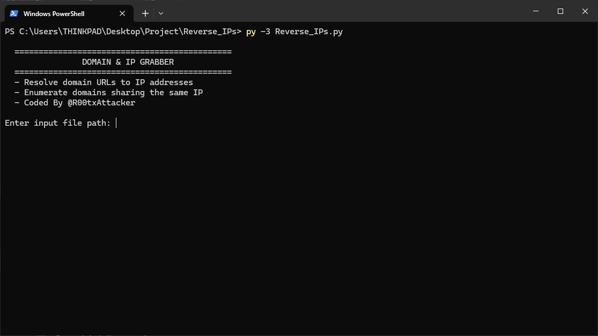

# 🔍 Reverse IP Script



A fast and simple Python tool for reverse IP lookups.  
It resolves domains to IPs, finds domains hosted on the same IP, and logs results to both console and file.

---

## 🚀 Features
- **Domain2IP & IP2Domain**  
- Resolves domains → IPs using DNS  
- Looks up all domains hosted on the same IP via [rapiddns.io](https://rapiddns.io/)  
- **Multi-threaded** for speed  
- Logs everything to **console and file**

---

## 📦 Installation
Clone the repo and install dependencies:

```bash
git clone https://github.com/R00txAttacker/reverse-ip-script.git
cd reverse-ip-script
pip install -r requirements.txt
